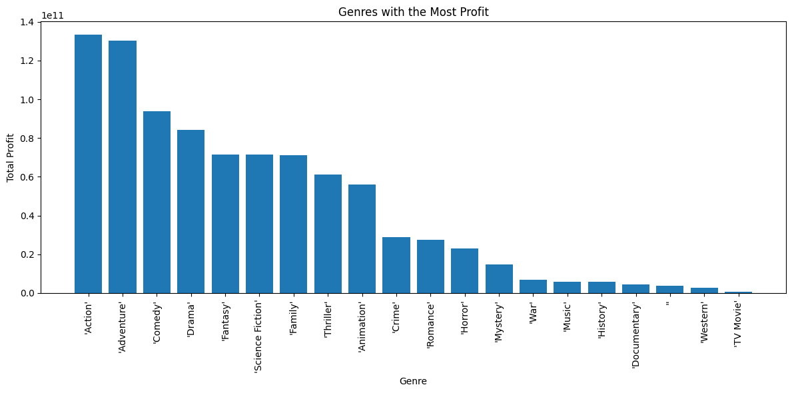

# Exploratory data analysis on Movie dataset
Using exploratory data analysis to generate insights for a Microsoft.

### Overview
This project analyzes movie data to provide insights and recommendations about the kind of movies Microsoft should make for their new movie studio.

### Business Problem
- What movie genre should microsoft produce.
- Do highly rated movies make more profit
- What should be the length.
- What time of the year should the movie be released.
- Who should be the writers.
- Who should be the directors.

### Data
The data provided has  `genres`, `domestic gross`, `foreign gross`, `ratings`, `production budget` and `persons` data.

From this dataset we can derive meaningful insights.

### Methods
I combined some datasets to have a better understanding.
To calculate profit, I took `domestic gross` + `foreign gross` - `production cost`.

### Results and Conclusions
1. What genres to make
This diagram shows the most rated genres. It can be used to infer which genre has a larger and more dedicated fan base.

The top 5 being `Drama`, `Comedy`, `Documentary`, `Action`, `Adventure`

This diagram shows the average rating for each genre. This combined with the diagram above can generate insights into the most liked genres. E.g: A movie with a high rating but low number of votes cast might signal a small but dedicated fan base. A genre with high votes count but an above average rating can signal a really good genre.

Do to the fact that not all genres received an equal number of votes. Any Genre that lies around the mean is okay.

This last diagram is a general analyisis that looks at the polularity of each genre

2. What time of the year should the movie be released.

Although it is not a very strong correlation. It is evident that the movies released later in the year tend to perform better.

3. What genres make the most profit.

The graph clearly shows `Action` and `Adventure` taking most of the profits as compared to the rest, `Comedy` and `Drama` follow.

4. What should be the length.
The plot below shows the average runtime of genres

5. Who should be the writers.
For this analysis I took the writers who have appeared in most movies. Experience will be a key factor

5. Who should be the directors.
For this analysis I took the directors who have appeared in most movies. Experience will be a key factor

### Recomendations
The movie produced should be Action and Adventure. The Movie should be released towards the end of the year as those movies have the best reviews as well as profit generated.
Experience cannot be understated and having onboard a director or writer who has a couple of movies under their belt would be good.

### Limitations.
The sample size of the dataset is small and a larger dataset can generate more insights.
Also It would be worth looking into the budget of each producer and writer associated in order to pick the lowest budget with the highest returns.

### Author details
[Email](mailto:contact@brandon.co.ke)
[LinkedIn](https://www.linkedin.com/in/brandon-omballa/)

